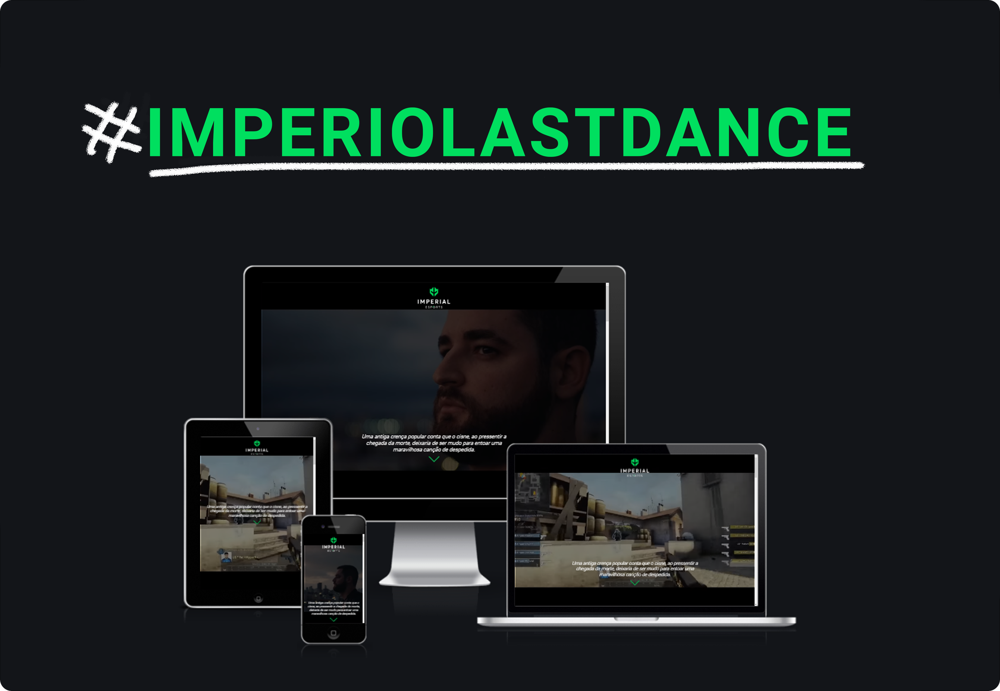

<h1 align="center">
  The Last IMPERIAL Dance
</h1>

  

  

  

  

  

<b>

  Link para acessar o projeto <a href="https://lucasfelipe-s.github.io/imperial/" target="_blank">Last IMPERIAL Dance</a>

</b>

## 💻 Projeto
Este é um projeto autoral, resolvi desenvolver essa aplicação porque sou muito fã do pessoal do Last Dance e também tinha que colocar em pratica o que aprendi sobre bootstrap, fiquei feliz com o resultado mesmo sendo iniciante na programação web.

Ferramentas usadas nesse projeto:
- VSCode
- Photoshop

Referências:
- Liquipedia
- HLTV

## 📥 Conhecimento adquirido:
Aprendi o que é Bootstrap, a diferença entre uma biblioteca e um framework e também foi muito interessante ler a documentação e conseguir colocar o conhecimento em um projeto pratico desenvolvido integralmente por mim.

## 📈 Desafios que tive:
Por incrível que pareça não tive tantas dificuldades na realização desse projeto, pois estava bastante focado e consegui aplicar bem minhas ideias, porém, um desafio que tive foi na estruturação do projeto em si, realizar ele sem um layout predefinido foi desafiador, mas acredito que fazer dessa forma agrega muito no processo de criatividade e faz a pessoa ter uma nova visão sobre os grandes projetos. 
Termino este projeto com grandes ideias florescendo na minha cabeça e com mais conhecimentos para aplicar no futuro.

## 👨‍💻 Informações pessoais

    
<small>Redes do criador</small>

    <section>
        
Linkedin: <a href="https://www.linkedin.com/in/lucas-felipe-39ab96236/" target="_blank" rel="noopener noreferrer">Lucas Felipe</a>

        
Github: <a href="https://github.com/lucasfelipe-s" target="_blank" rel="noopener noreferrer">Lucas Felipe</a>

        
Instagram: <a href="https://www.instagram.com/_lucasflp/" target="_blank" rel="noopener noreferrer">@_lucasflp</a>

    </section>

